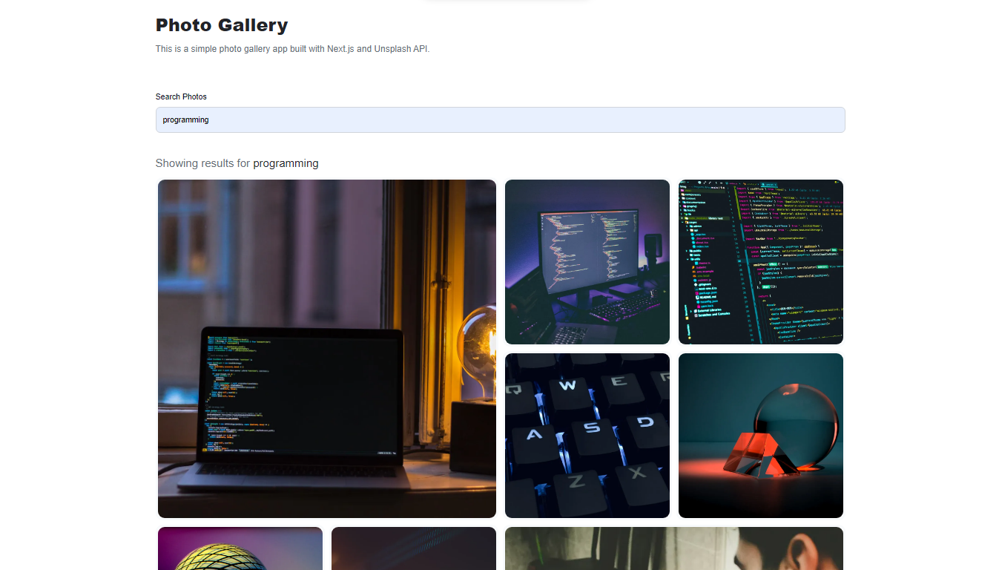
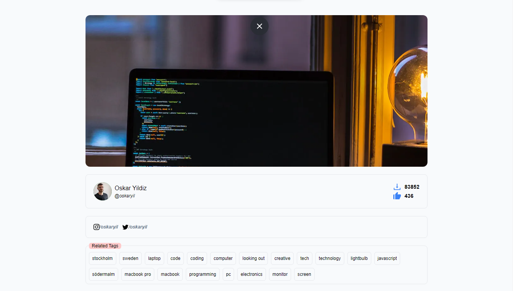

# unsplash-image-gallery

## Table of Contents

- [About](#about)
- [Getting Started](#getting_started)
- [Usage](#usage)
- [Contributing](../CONTRIBUTING.md)

## About <a name = "about"></a>

This is a simple image gallery that uses the Unsplash API to fetch images. It is built with React and Tailwind CSS.

```
Codesandbox: https://codesandbox.io/p/github/TajwarSaiyeed/unsplash-photo-gallery/main
```

# Images




## Getting Started <a name = "getting_started"></a>

These instructions will get you a copy of the project up and running on your local machine for development and testing purposes. See [deployment](#deployment) for notes on how to deploy the project on a live system.

### Prerequisites

What things you need to install the software and how to install them.

```
Unsplash API Key
```

### Installing

A step by step series of examples that tell you how to get a development env running.

Say what the step will be

```
npm install
```

## Usage <a name = "usage"></a>

Add notes about how to use the system.

Add the Unsplash API key to the .env file

```
NEXT_PUBLIC_APP_UNSPLASH_ACCESSKEY=YOUR_API_KEY
```

```
npm run dev
```

Open [http://localhost:3000](http://localhost:3000) with your browser to see the result.

If you want to deploy the app, you can use Vercel. It is a great platform for deploying Next.js apps.
